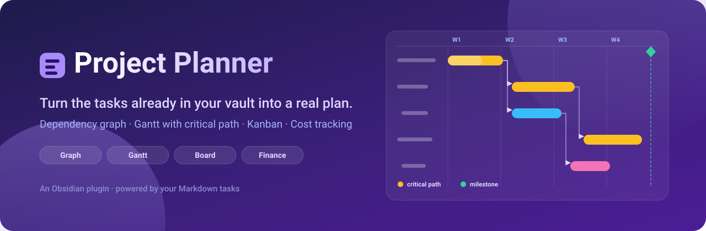

<p align="center">
  
</p>

<p align="center">
  
  
  
  
  
</p>

---

**Project Planner** turns the tasks you already have in your Obsidian vault into a
plan you can actually run a project from — a dependency graph, a Gantt chart
with a real critical path, a kanban board, and time-and-materials costing.

Nothing lives in a proprietary database. Every task, date, dependency, person
and cost is read from and written back to plain Markdown, in the same
[Tasks](https://github.com/obsidian-tasks-group/obsidian-tasks) and Dataview
syntax you were already using. Delete the plugin and your notes still read
exactly the same.

<p align="center">
  
</p>

---

## Contents

- [Why this exists](#why-this-exists)
- [Requirements](#requirements)
- [Installation](#installation)
- [Quick start](#quick-start)
- [How tasks are read](#how-tasks-are-read)
- [The graph view](#the-graph-view)
- [The Gantt view](#the-gantt-view)
- [The board view](#the-board-view)
- [Finance](#finance)
- [Embedding a graph in a note](#embedding-a-graph-in-a-note)
- [Companion notes](#companion-notes)
- [Undo](#undo)
- [Metadata reference](#metadata-reference)
- [Commands](#commands)
- [Settings](#settings)
- [Relationship to Tasks Map](#relationship-to-tasks-map)
- [Development](#development)
- [License](#license)

---

## Why this exists

Most task plugins are good at *capture* and weak at *planning*. They will tell
you what is due on Thursday. They will not tell you which of the eleven things
due on Thursday is the one that, if it slips, moves your delivery date.

Project Planner is built around dependencies rather than dates:

- **Dependencies are the primary data.** A task that is blocked knows what it
  is waiting on, and every view is a different way of reading the same graph.
- **Every task gets a bar, dated or not.** Undated tasks are placed by their
  dependencies rather than dropped, so a plan is useful before anybody has sat
  down to fill in dates.
- **Suggestions are never silently written.** Inferred dates are drawn dashed
  and stay out of your notes until you accept them.
- **Nothing is invented.** Shares that do not total 100% are reported, not
  scaled. People with no rate cost nothing and are listed as unpriced. Costs
  resting on guessed dates are counted separately from costs resting on real
  ones.

---

## Requirements

| Plugin | Required? | Why |
| --- | --- | --- |
| [Dataview](https://github.com/blacksmithgu/obsidian-dataview) | **Yes** | Reads inline `- [ ]` checkbox tasks out of your vault. The views refuse to render without it. |
| [Tasks](https://github.com/obsidian-tasks-group/obsidian-tasks) | Optional | Adds **Create task** and **Edit task** to the node context menu, using the Tasks plugin's own modal. |

Obsidian **1.8.0** or newer. Works on desktop and mobile — no Node or Electron
APIs are used.

---

## Installation

### From the community plugin browser

**Settings → Community plugins → Browse**, search for **Project Planner**,
install and enable.

### Manually

1. Download `main.js`, `manifest.json` and `styles.css` from the
   [latest release](https://github.com/HMIL1151/project-planner/releases).
2. Copy them into `<your-vault>/.obsidian/plugins/project-planner/`.
3. Reload Obsidian, then enable **Project Planner** under **Community plugins**.

---

## Quick start

Write two ordinary tasks in any note, and give one an ID the other can point at:

```markdown
- [ ] Draw up the frame 🆔 frame 🛫 2026-03-02 📅 2026-03-06
- [ ] Weld the frame ⛔ frame 📅 2026-03-11
- [ ] Paint it ⛔ weld
- [ ] Ship it 🆔 ship ⛔ paint
```

Open the **graph** icon in the ribbon. You get four connected nodes. Open the
**Gantt** icon and you get four bars — the two with dates drawn where you put
them, the two without drawn dashed, placed the day after whatever blocks them.

Turn on **Critical path** and the chain that decides the finish date lights up.

---

## How tasks are read

Two kinds of task, both first-class, both read into the same model.

### Inline checkbox tasks

Any `- [ ]` line anywhere in your vault, read via Dataview.

```markdown
- [ ] Fit the sensor loom 🆔 loom ⛔ frame 🛫 2026-03-02 📅 2026-03-06 #electrical 🔼
```

Statuses come from the checkbox itself: `[ ]` to do, `[/]` in progress,
`[x]` done, `[-]` cancelled.

### Note tasks

A whole note becomes one task when its frontmatter is tagged `task`. Use these
when a task needs somewhere to put detail.

```yaml
---
tags:
  - task
start: 2026-03-02
due: 2026-03-06
blockedBy: [frame]
progress: 40
---
```

### Both syntaxes, everywhere

Dependencies and metadata can be written as Tasks-plugin emoji or as Dataview
inline fields, and the two can be mixed freely across a vault. Project Planner
reads whichever a line already uses and **writes back in the same style**, so
it never reformats notes into a house style you did not choose.

```markdown
- [ ] Emoji style  🆔 a1 ⛔ b2 📅 2026-03-06
- [ ] Dataview style [id:: a1] [dependsOn:: b2] [due:: 2026-03-06]
```

---

## The graph view

The dependency graph, on a pannable ReactFlow canvas with automatic
[dagre](https://github.com/dagrejs/dagre) layout.

### Nodes

Each task is a node showing its text, status, tags, priority and progress.
Node controls:

| Control | Action |
| --- | --- |
| Status circle | Cycle the task's completion status |
| Star | Star or unstar the task (`⭐`) |
| Arrow | Open the note the task lives in |
| **⋮** | Context menu — create a child task, edit, set finance, delete |
| Tag chips | Click **×** to remove a tag, **+ Add tag** to add one |

Wiki-links in task text render as real links and open the note they point at.

### Edges

Drag from a node handle to another node to create a dependency; the `⛔`/`🆔`
metadata is written into both notes. Click an edge and press `Delete` to remove
it, which strips the reference from the vault.

**Chain healing:** deleting a task in the middle of `A → B → C` hands B's
blockers to whatever was waiting on B, so `A → C` survives rather than the
chain quietly falling apart.

**Per-edge styling:** right-click an edge to override its line style
individually, on top of the global Bezier / Straight / SmoothStep setting.

### Critical path

Toggle **Critical path** to compute float across the whole plan — the gap
between when each task finishes and the latest it could finish without moving
the delivery date. Tasks with zero float are the critical path and are
highlighted in both the graph and the Gantt. This is the set worth arguing
about when a deadline is at risk; everything else has room to move.

### Search, filters and traversal

The right-hand filter panel carries:

| Filter | Description |
| --- | --- |
| Search | By task text, ID or tag, with a live suggestion list (`↑`/`↓`/`Enter`/`Escape`) |
| Show dependencies / dependents | Pull the upstream and/or downstream chain of a search hit into view |
| Status | Multi-select — to do, in progress, done, cancelled |
| Include labels | Show only tasks carrying at least one selected tag |
| Exclude labels | Hide tasks carrying any selected tag |
| Files / folders | Restrict to selected notes or folders |
| Only starred | Show only starred tasks |

**Filter presets** save any combination by name, restore it in one click, and
can be inserted straight into a note as an embed block.

### Unlinked tasks panel

Tasks with no dependencies in either direction are moved to a left-hand panel
rather than scattered across the canvas as noise. Search it, then drag any task
onto the canvas to work with it. Connect it to something and it stays on the
canvas for good.

### Project groups

Tasks sharing a project are drawn inside a labelled group container, so a large
vault reads as a handful of projects rather than one undifferentiated cloud.

---

## The Gantt view

The same tasks on a timeline.

### Every task gets a bar

A chart that only drew dated tasks would be nearly empty in a real vault, so
every task is placed:

| The task has | The bar is |
| --- | --- |
| Start (`🛫`, or `⏳` as fallback) and due (`📅`) | Drawn between them |
| Start only | One day long |
| Due only | Drawn from when its blockers finish up to the deadline — the window available |
| Neither | Starts the day after its last blocker finishes, lasts one day |

Because inference walks the dependency graph, a chain of undated tasks spreads
out day by day in the order the graph says they must happen.

### Suggested dates stay suggestions

Inferred bars are drawn as **dashed outlines** and nothing is written to your
notes while they stay that way. Turn a proposal into a real date by dragging
or resizing the bar, or use **Apply suggested dates** to write every dashed bar
at once and get a count of what changed.

### Editing

| Action | Result |
| --- | --- |
| Drag a bar sideways | Moves start and due together, keeping the length |
| Drag either edge | Changes that date alone |
| Click a task name | Selects the row and lights up its whole dependency chain |
| Drag the grip | Reorders rows; the order is saved |
| **+** on a row | Writes a new task directly below it, in the same note |
| **Link** on a row | Starts a dependency — click the task it should block |

Dragging snaps to whole days and a bar can never be shorter than one day.

### Scheduling controls

- **Working days** — measure durations in working days and keep bars off
  weekends. The finance view follows the same setting, so money and schedule
  can never disagree.
- **Sort by date** — a *mode*, not a one-off shuffle: rows are drawn flat and
  earliest first while it is on, and your manual order and nesting come back
  untouched when you turn it off.
- **Group by** — tag, status, note or project.
- **Collapse** — fold a parent's children away; parents roll their children's
  span up into one bar.
- **Zoom** — days, weeks or months, with a **Today** button.

### Milestones

Named days marked across the whole chart — "Design freeze", "Release 1.0" —
drawn as a diamond in their own band with a dashed line down the timeline.
Milestones are not tasks: no note, no duration, no dependencies, and nothing is
ever written to your vault. Past milestones draw grey, today's orange, future
ones purple. The timeline always stretches far enough to reach them.

### Schedule warnings

Three ways a plan quietly goes wrong, flagged on the rows and counted under the
chart:

| Warning | Meaning |
| --- | --- |
| **Overdue** | Finished on paper before today, and not marked done |
| **Stalled** | Should have started, and has not been touched |
| **Backwards dependency** | A blocker finishes *after* the work waiting on it |

Only dates you actually wrote are judged — flagging the chart's own guesses
would be noise.

### PNG export

Export the chart as a picture for a report or a slide. This is deliberately
**not** a screenshot: it is a separate drawing of the same plan, laid out for
paper. The whole timeline is fitted to the page width so nothing runs off the
edge; it uses four print-safe colours; it drops weekend bands, day ticks and
dependency arrows, which are the first things to become noise at page size; and
it makes the parts that carry meaning bigger — title, span, group headings,
milestone names, and a legend listing only what the chart actually uses. Today
is marked only when today falls inside the plan.

---

## The board view

Where the Gantt answers *when*, the board answers *what state is this in* — and
dragging a card is what changes the answer.

| Group by | Columns | Dragging writes |
| --- | --- | --- |
| Status | To do, In progress, Done, Cancelled | The checkbox |
| Due date | Late, Today, Tomorrow, Rest of this week, Next week, Later, No date | The `📅` due date |
| Person | One per name in `[people:: …]`, plus Unassigned | The task's people |
| Tag | One per tag in use, plus No tag | The task's tags |
| Project | One per project | *read only* |
| Priority | 🔺 ⏫ 🔼 🔽 ⏬, plus No priority | *read only* |
| Note | One per note holding tasks | *read only* |

Dropping a card into a date column writes a real due date, so the card stays
where you put it. Dropping one into a person's column makes it theirs alone;
dropping it into **Unassigned** removes the people entirely. Read-only
groupings show a padlock and refuse cards from other columns, but cards can
still be reordered within them.

Card order is one list for the whole board, so a card dragged to another column
keeps the position you dropped it in, and changing the grouping does not throw
your arrangement away. Columns can be folded away, remembered per grouping. The
**+** in a column header adds a task already carrying whatever that column
stands for.

---

## Finance

Time-and-materials planning, **off by default** — enable it under
**Settings → Project Planner → Finance**.

A task consumes hours; those hours are worked by named people in some
proportion; each person sits at a grade with a chargeout rate; and materials
sit on top.

### The rates note

Rates live in a note you own, not in plugin settings, so you can link to them
and keep them in version control. Default path `Finance/People and rates.md`.

```markdown
| Grade      | Rate |
| ---------- | ---- |
| Principal  | 145  |
| Senior     | 110  |

| Person      | Grade     | Rate |
| ----------- | --------- | ---- |
| Alice Smith | Principal |      |
| Cara Diaz   | Senior    | 130  |
```

Tables are found by their **column headers**, not the headings above them, so
you can retitle, reorder and write whatever prose you like around them. A
person's own `Rate` overrides their grade's. Rows that cannot be read are
dropped and reported with their line number.

### Putting finance on a task

```markdown
- [ ] Fit the loom [hoursPerDay:: 6] [people:: Alice Smith 60%, Bob Jones 40%] [costs:: Loom kit 240, Travel 85]
```

| Field | Meaning |
| --- | --- |
| `hours` | Explicit total hours — wins over everything |
| `hoursPerDay` | Per-task override of the global default |
| `people` | Who is on it, and their share |
| `costs` | Materials and expenses |

Synonyms are accepted (`totalHours`/`estimatedHours` → `hours`,
`allocations`/`who` → `people`, `expenses`/`materials` → `costs`), and shares
may be written `60%`, `60` or `0.6`. The canonical spelling is written back.

### How the cost is worked out

Hours come from an explicit total if there is one, otherwise from the length of
the task's bar × its hours-per-day. Rates resolve person-first, then grade.
Name matching is on meaning, not typing — `Alice Smith`, `alice  smith` and
`[[Alice Smith]]` are one person.

**What it refuses to fake:**

- Someone with no rate costs **nothing**, and their hours are reported as
  unpriced rather than counted as free.
- Shares that do not total 100% are used **exactly as written** — scaling
  60% + 30% up to 100% would hide a typo and inflate the plan.
- Cost resting on *suggested* dates is counted separately, and
  **Include suggested dates** leaves it out. A vault full of undated tasks will
  never quietly read as a large invented cost.

### The dashboard

Headline tiles (total, labour, materials, hours, tasks priced, tasks with no
finance), the labour/materials split, a **breakdown** by person, grade,
project, tag, status or note, **cost over time** by week or month, the **ten
biggest costs** each clickable through to the Gantt, and a **Problems** section
listing everything that could not be worked out.

---

## Embedding a graph in a note

A fenced `project-planner` block renders a fully interactive graph inline.

````markdown
```project-planner
{
  "filter": {
    "onlyStarred": true,
    "selectedStatuses": ["todo", "in_progress"]
  },
  "config": {
    "height": 300,
    "showMinimap": false,
    "showFilterPanel": false
  }
}
```
````

An empty body (`{}`) shows the full graph with defaults.

**Filter keys:** `selectedTags`, `excludedTags`, `selectedStatuses`,
`selectedFiles`, `searchQuery`, `traversalMode`
(`match`/`upstream`/`downstream`/`both`), `onlyStarred`.

**Config keys:** `height`, `showMinimap`, `showFilterPanel`,
`showPresetsPanel`, `showUnlinkedPanel`, `showStatusCounts`.

Rather than writing these by hand, use **Insert current filter as embedded
graph** from the command palette, or the insert button on a saved filter
preset — both generate correct JSON.

> Blocks tagged ` ```tasks-map ` from before the rename are still rendered, so
> notes written against the old plugin keep working.

---

## Companion notes

A checkbox line has nowhere to put detail. With companion notes enabled,
creating a task also creates a note for it and turns the task's text into a
link to that note. The note is deliberately **not** tagged `task` — that would
make it a second task in its own right and draw a duplicate node.

**Create notes for existing tasks** retrofits the whole vault at once, after
asking for confirmation and telling you how many notes it will write.

---

## Undo

One undo history, owned by the plugin and shared across every view — so the
board can take back an edit the Gantt made, and vice versa. Row reorders, card
moves, date drags, milestone changes, people reassignments and tag edits all
step back through it.

Vault writes are optimistic: the UI updates immediately and rolls back if the
write fails.

---

## Metadata reference

Everything Project Planner reads and writes. Every emoji field has a Dataview
equivalent in `[field:: value]` or `(field:: value)` form.

| Concept | Emoji | Dataview | Note-task frontmatter |
| --- | --- | --- | --- |
| Task ID | `🆔 abc` | `[id:: abc]` | — (the note is the identity) |
| Blocked by | `⛔ abc` or `⛔ a,b,c` | `[dependsOn:: abc]` | `blockedBy:` / `dependsOn:` |
| Due date | `📅 2026-03-06` | `[due:: 2026-03-06]` | `due:` |
| Start date | `🛫 2026-03-02` | `[start:: 2026-03-02]` | `start:` |
| Scheduled | `⏳ 2026-03-02` | `[scheduled:: …]` | `scheduled:` |
| Created / done / cancelled | `➕` `✅` `❌` | — | — |
| Priority | `🔺 ⏫ 🔼 🔽 ⏬` | — | — |
| Starred | `⭐` | — | — |
| Progress | — | `[progress:: 40]` or `40%` | `progress:` |
| Parent | — | `[parent:: abc]` | `parent:` |
| Tags | `#tag` | — | `tags:` |
| Hours | — | `[hours:: 12]` | `hours:` |
| Hours per day | — | `[hoursPerDay:: 6]` | `hoursPerDay:` |
| People | — | `[people:: Alice 60%, Bob 40%]` | `people:` |
| Costs | — | `[costs:: Loom kit 240]` | `costs:` |

Out-of-range progress is clamped rather than rejected — someone who typed 120
meant "finished". Progress above zero displays as in-progress whatever the
checkbox says, but 100% is never auto-promoted to done: finishing the work and
declaring the task closed are different claims, and only the second is yours to
make.

---

## Commands

| Command | Description |
| --- | --- |
| Open graph view | The dependency graph |
| Open Gantt view | The timeline |
| Open board view | The kanban board |
| Open task finance | The finance dashboard *(when finance is enabled)* |
| Create the rates note | Creates and opens the rates note *(when finance is enabled)* |
| Create notes for existing tasks | Retrofit companion notes across the vault |
| Insert current filter as embedded graph | Write an embed block into a note |

Ribbon icons are provided for the graph, Gantt, board and — when enabled —
finance views.

---

## Settings

| Group | Settings |
| --- | --- |
| **Display** | Show priorities, show tags, show status counts |
| **Layout** | Direction (horizontal/vertical), edge style (Bezier/Straight/SmoothStep), SmoothStep corner radius |
| **Tag appearance** | Palette (Rainbow, Ocean, Forest, Sunset, Mono) plus per-tag colour pinning, with **Reset all** |
| **Task relations** | How dependencies are written: CSV, individual, or Dataview |
| **Gantt** | Working days, critical path, schedule warnings, row order and collapsed rows |
| **Board** | Group-by, card order, collapsed columns |
| **Finance** | Enable, rates note path, default hours per day, currency, include suggested dates |
| **Companion notes** | Enable, and the folder to write them to |
| **Language** | English, Nederlands, 简体中文 |
| **Advanced** | Debug visualisation overlays |

---

## Relationship to Tasks Map

Project Planner began life as a fork of
**[Tasks Map](https://github.com/NicoKNL/tasks-map)** by
[Nico Klaassen](https://github.com/NicoKNL), and it owes that project its
foundation: the graph canvas, the dual inline/note task model, the Dataview
integration and the filtering core all started there. Credit where it is due —
that groundwork is what made the rest possible, and it remains MIT licensed
with the original copyright notice intact.

It has since grown into a substantially different plugin. Tasks Map visualises
tasks as a graph. Project Planner is a project-planning tool that happens to
include that graph. Added since the fork:

- **The Gantt view** in its entirety — date inference from the dependency
  graph, dashed suggestions that stay out of your notes, drag-to-schedule,
  working-day scheduling, grouping and collapsing, date-order mode, milestones,
  schedule-risk warnings, and print-oriented PNG export.
- **Critical path analysis** — float computed across the whole plan, surfaced
  in both the graph and the Gantt.
- **The kanban board** — seven groupings, each writing back the thing its
  columns stand for.
- **The finance system** — rate books read from a note you own, per-task hours,
  people and materials, cost roll-ups by person, grade, project, tag, status
  and note, cost-over-time, and a problems report that refuses to invent
  numbers.
- **Companion notes**, with vault-wide retrofit.
- **Chain healing** on task deletion, so removing a task does not break the run
  of work through it.
- **Plugin-wide shared undo** across every view.
- **Progress tracking**, parent/child hierarchy, project grouping, per-edge
  style overrides and filter presets.

The name changed because "Tasks Map" no longer described it. This is a planner
that reads your tasks, not a map of them.

---

## Development

```bash
npm install
npm run dev
```

| Command | Purpose |
| --- | --- |
| `npm run dev` | esbuild watch build |
| `npm run build` | Typecheck + production bundle |
| `npm run build:deploy` | Build, then copy into a local vault |
| `npm test` | Jest |
| `npm run lint` | ESLint over `src/**/*.{ts,tsx}` |
| `npm run lint:css` | Stylelint |
| `npm run format` | Prettier check |

`src/lib/` is pure, framework-free logic — scheduling, critical path, finance,
costing, Gantt rows, filtering and graph traversal — and is where the unit
tests point. React components stay presentational.

Set a deploy target in `.obsidian-plugin-dir` or `$OBSIDIAN_PLUGIN_DIR`;
`deploy.mjs` copies `main.js`, `manifest.json` and `styles.css` and never
touches your vault's `data.json`.

Contributions are welcome — please open an issue or PR.

---

## License

[MIT](LICENSE).

Copyright © 2025 Nico Klaassen (original Tasks Map plugin) and
© 2025–2026 Harrison Milburn (Project Planner). The original copyright notice
is retained as the MIT License requires.
